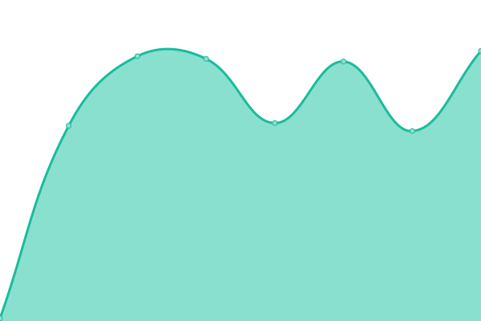

# [📈 Live Status](https://trannhatkhoacm1612.github.io/khoa): <!--live status--> **🟩 All systems operational**

<!--start: status pages-->
<!-- This summary is generated by Upptime (https://github.com/upptime/upptime) -->
<!-- Do not edit this manually, your changes will be overwritten -->
<!-- prettier-ignore -->
| URL | Status | History | Response Time | Uptime |
| --- | ------ | ------- | ------------- | ------ |
|  [Google](https://www.google.com) | 🟩 Up | [google.yml](https://github.com/trannhatkhoacm1612/khoa/commits/HEAD/history/google.yml) | 

 81ms
     
 | 

<a href="https://trannhatkhoacm1612.github.io/khoa/history/google">100.00%</a>
    

|  [Youtube](https://www.youtube.com) | 🟩 Up | [youtube.yml](https://github.com/trannhatkhoacm1612/khoa/commits/HEAD/history/youtube.yml) | 

 247ms
     
 | 

<a href="https://trannhatkhoacm1612.github.io/khoa/history/youtube">100.00%</a>
    

<!--end: status pages-->undefined
